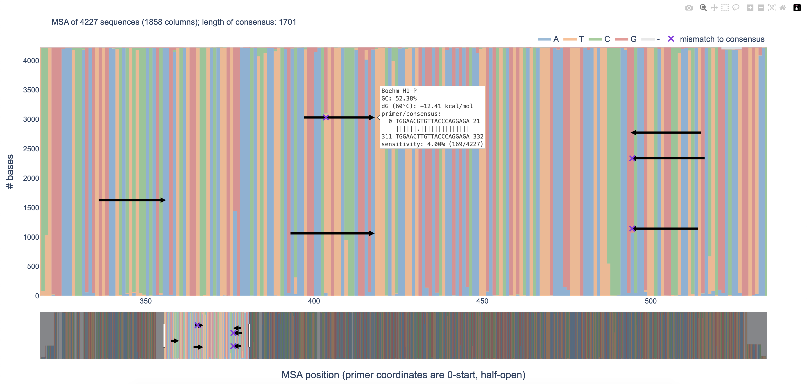

## validate.py
This Python module includes features to be implemented in future [Olivar](https://github.com/treangenlab/Olivar) updates. 
1. Given a Multiple Sequence Alignment (MSA), output the consensus sequence, as well as a list of the location and frequencies of variations/SNPs, using the consensus as reference. 
2. Visualize an MSA along with attached primers/probes, and validate their alignment and sensitivity. Ambiguous bases are supported. 


## Dependencies
```
python >=3.8
biopython >=1.8
numpy
plotly >=5
tqdm
```

## Installation
1. Install Miniconda if not installed already ([quick command line install](https://docs.conda.io/projects/miniconda/en/latest/#quick-command-line-install))

2. Create a Conda environment called "myenv" and install required packages
```bash
conda create -n myenv biopython plotly tqdm mafft --channel conda-forge
```
3. Add `validate.py` to your PATH, or copy it to your working directory. 

4. Activate your conda environment
```bash
conda activate myenv
```
5. Run `validate.py -h` if added to PATH, or `./validate.py -h` if copied to your working directory. 

## Usage
Use one of the sub-commands: `snps` for variant calling for an MSA, `validate` for validating and visualizing primers/probes with an MSA. 
> [!TIP]
> Use the `--threads` or `-p` option for faster processing time. 

### Variant calling with `snps`
Using example input files
```bash
./validate.py snps example/H1N1-2024-04-25-HA-MSA.fasta
```
Outputs are `example/H1N1-2024-04-25-HA-MSA.fasta.consensus.fasta` and `example/H1N1-2024-04-25-HA-MSA.fasta.csv`. 
```
usage: validate.py snps [-h] [--prefix <string>] [--threads <int>] msa-fasta

Input an MSA, output the consensus sequence, as well as a list of the location and frequencies of variations/SNPs, using the consensus as reference

positional arguments:
  msa-fasta             Path to the MSA file in FASTA format.

options:
  -h, --help            show this help message and exit
  --prefix <string>, -o <string>
                        Prefix for output files (.consensus.fasta and .csv). If not provided, use the MSA file path.
  --threads <int>, -p <int>
                        Number of threads [1].
```
> [!TIP]
> You may use `mafft` to make an MSA. `mafft` is already installed if you followed the installation guide. 
> ```
> mafft --auto --thread 1 sequences.fasta > MSA.fasta
> ```

### Validating and visualizing primers/probes with `validate`
Using example input files
```bash
./validate.py validate example/H1N1-2024-04-25-HA-MSA.fasta --oligos example/primers.csv
```
Outputs are `example/primers.csv.html` and `example/primers.csv.out`. 
```
usage: validate.py validate [-h] [--oligos <string>] [--temperature <float>] [--sodium <float>] [--prefix <string>] [--threads <int>] msa-fasta

Visualize an MSA, along with its primers/probes (if provided), and validate their alignment and sensitivity.

positional arguments:
  msa-fasta             Path to the MSA file in FASTA format.

options:
  -h, --help            show this help message and exit
  --oligos <string>     Optional, path to the CSV (comma-separated values) file of oligo names and sequences. For example, 
                            H1-F,GTGAATCACTCTCCACAGCA
                            H1-R,TGATTRGGCCATGAACTTGT
                            H1-P,TGGAACGTGTTACCCAGGAGA
  --temperature <float>, -t <float>
                        Annealing temperature in Degree Celsius [60.0].
  --sodium <float>, -s <float>
                        The sum of the concentrations of monovalent ions (Na+, K+, NH4+), in molar [0.18].
  --prefix <string>, -o <string>
                        Prefix for output files (.out and .html). If not provided, use --oligos, or the MSA file path.
  --threads <int>, -p <int>
                        Number of threads [1].
```

### Features to be added to `olivar validate`
1. Input unaligned sequences in FASTA format, and output an MSA with MAFFT. Ideally, we want to automatically detect if a file is aligned or not. **[PENDING]**
```python
with open('MSA.fasta', 'w') as mafft_out:
    cmd_out = run_cmd('mafft', '--auto', '--thread', str(n_cpu), 'sequences.fasta')
    mafft_out.write(cmd_out.stdout)
```
2. Input an MSA file (or use the file generated in step 1), and a list of primers (names and sequences, in CSV format)
   - a. output validation info for each primer (GC, dG, alignment, sensitivity, etc.). **[DONE]**
   - b. plot the MSA along with the primers, and save the plot as HTML using Plotly. **[DONE]**

### Features to be added to `olivar build`
1. Same as `olivar validate` step 1. 
2. Input an MSA file (or use the file generated in step 1), and output location and frequencies of variations using the consensus sequence as reference. **[DONE]**
